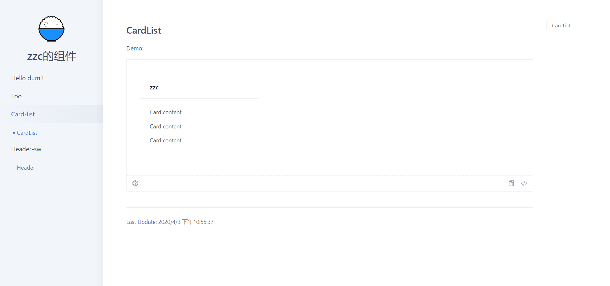

# dumi library

## 开始

[dumi 官网](https://d.umijs.org/)

创建组件开发的目录

```
mkdir library && cd library
```

组件开发脚手架

```
npx @umijs/create-dumi-lib        # 初始化一个文档模式的组件库开发脚手架
# or
yarn create @umijs/dumi-lib

npx @umijs/create-dumi-lib --site # 初始化一个站点模式的组件库开发脚手架
# or
yarn create @umijs/dumi-lib --site
```

目前，dumi 支持两种呈现模式，分别是文档模式和站点模式。在两种模式之间切换也非常地简单：

```
// config/config.ts 或 .umirc.ts
export default {
  // 文档模式（默认值）
  mode: 'doc',
  // 站点模式
  mode: 'site',
};
```

当开发没有那么丰富的内容时先使用`doc`,到后续复杂了可以切换为`site`

安装依赖

```bash
$ npm i
```

运行开发环境

```bash
$ npm start
```

运行效果:



生成文档

```bash
$ npm run docs:build
```

使用`father-build`生成组件库

```bash
$ npm run build
```

## 使用

### 配置

dumi 的配置集成了 umi 与 umi-library（father）。

#### dumi

dumi 配置时基于 umi 的配置，所以 dumi 配置直接使用 umi 配置是完全支持的。
而它是在开发时与生成文档网站时使用的。

修改`.umirc.ts`文件

```
import { defineConfig } from 'dumi';

export default defineConfig({
  title: 'zzc的组件',
  extraBabelPlugins: [
    [
      'babel-plugin-import',
      {
        libraryName: 'antd',
        libraryDirectory: 'es',
        style: true,
      },
      'antd',
    ],
  ],
  // more config: https://d.umijs.org/config
});

```

title 文档网站的名称，extraBabelPlugins 配置额外的 babel 插件，就是 babel 的.babelrc 的 plugins。

[dumi 配置](https://d.umijs.org/config)
[umi 配置](https://umijs.org/config)

#### umi-library（father）

umi-father 是打包代码使用的，既需要上传代码到 npm 前使用。

修改配置文件`.fatherrc.ts`

打包格式：

1. esm -> 浏览器环境
2. cjs -> nodejs 环境（测试|ssr）
3. umd -> 通过浏览器 script 引入的方式

打包方式分为两种，babel 与 rollup，但推荐使用 rollup，一般来说项目的开发都是使用 webpack 的，所以可以使用 Tree Shaking 特性，所以按需加载的特性的必要性是没有那么大的，而使用 babel 打包的主要目的就是为了按需加载，当然不排除特殊场景需要 babel 的方式。

rollup 其实与 webpack 效果是差不多的，都是模块化打包，但 rollup 打包出代码更简洁可读，在打包类库上效果比 webpack 好。
babel 的打包方式就是流的打包方式，不会整合代码，只编译当前文件然后输出。

extractCSS 配置是否提取 css 为单独文件。

lessInBabelMode 在 babel 模式下做 less 编译，基于 gulp-less，默认不开启。

umd 的 globals 可以参考 rollup 的 API

```
export default {
  esm: 'babel',
  cjs: 'rollup',
  umd: {
    globals: {
      react: 'React', // 这跟external 是配套使用的，指明global.React即是外部依赖react
    },
  },
  extractCSS: true,
  lessInBabelMode: true,
  extraBabelPlugins: [
    ['import', { libraryName: 'antd', libraryDirectory: 'es', style: true }],
  ],
};

```

##### 注意:

1. 通常只要配置 esm: "rollup" 就够了
2. cjs 和 esm 支持 rollup 和 babel 两种打包方式，rollup 是跟进 entry 把项目依赖打包在一起输出一个文件，babel 是把 src 目录转化成 lib（cjs） 或 es（esm）
3. 如果要考虑 ssr，再配上 cjs: "rollup"
4. package.json 里配上 sideEffects: false | string[]，会让 webpack 的 tree-shaking 更高效

关于 dependencies、peerDependencies 和 external

1. cjs 和 esm 格式打包方式选 rollup 时有个约定，dependencies 和 peerDependencies 里的内容会被 external
2. esm.mjs 和 umd 格式，只有 peerDenendencies 会被 external
3. 打包方式 babel 时无需考虑 external，因为是文件到文件的编译，不处理文件合并

[umi-father 3.X 文档](https://github.com/umijs/father)
[umi-father 2.X 文档](https://github.com/umijs/father/tree/2.x)

## npm 发布

1. 登陆账号

```
npm login # 输入用户名 密码
```

2. publish

```
npm publish # 需要确保 package.json version 与上一个版本不一样
```

版本的更加

```
// 小版本更改 如从1.0.1->1.0.2
npm version patch
// 中版本更改 如从1.0.1->1.1.0
npm version minor
// 大版本更改 如从1.0.1->2.0.1
npm version major
```

**使用私仓需要注意:**
发布到私仓里，需要 package.json 配置，否则会发布失败

```

{
"publishConfig":{
{"registry":"私仓地址"}
}
}

```

在发包时 package 内需要配置的一些字段

```

name: 配置包的名称
version: 版本号
main: 包主入口
files： 你要上传那些文件件

// 非官方
unpkg: 让 npm 上所有的文件都开启 cdn 服务。
module: 就像 main 字段一样，定义一个针对 es6 模块及语法的入口文件。

```

module:
构建工具在构建项目的时候，如果发现了这个字段，会首先使用这个字段指向的文件，如果未定义，则回退到 main 字段指向的文件。
支持的工具：rollup 与 webpack

[unpkg 资料](https://unpkg.com/)
[package.json 非官方字段集合](https://segmentfault.com/a/1190000016365409)

## 错误收集

1. node_modules/hoist-non-react-statics/index"' has no exported member 'NonReactStatics'

```

这是 ts 报的，需要重新安装以下@types/hoist-non-react-statics 与 hoist-non-react-statics，因为版本不对。

```

2. vfile-message

```

/dumi-library/node_modules/@types/vfile/index.d.ts(11,31): error TS7016: Could not find a declaration file for module
'vfile-message'. 'D:/codeTest/react-study/dumi-library/node_modules/vfile-message/index.js' implicitly has an 'any' type.
Try `npm install @types/vfile-message` if it exists or add a new declaration (.d.ts) file containing `declare module 'vfile-message';`

    这要重新安装vfile-message，不要试图安装@types/vfile-message。

```

3. The 'this' keyword is equivalent to 'undefined' at the top level of an ES module, and has been rewritten

```

yarn add -D rollup-plugin-regenerator

var rollup = require('rollup').rollup;
var regenerator = require('rollup-plugin-regenerator');

rollup({
input: 'my-entry.js',
context: 'window', // or 'global' for Node.js
plugins: [
regenerator()
]
}).then(...);

```

[rollup-plugin-regenerator](https://cnpmjs.org/package/rollup-plugin-regenerator)

4. 使用 umd 时 external 外部引用的都要放到 peerDependencies 里，否则打包会报错。

5. father-build 要使用`1.18.0`以上的，否则 father 某些 API 是无效的，father 可生成文档，打包等功能，而 father-build 只拥有 father 的打包功能

#### [Rollup.js 中文网](https://www.rollupjs.com/guide/introduction/)

#### [Rollup 常用配置](https://www.jianshu.com/p/499bd3b93138)
